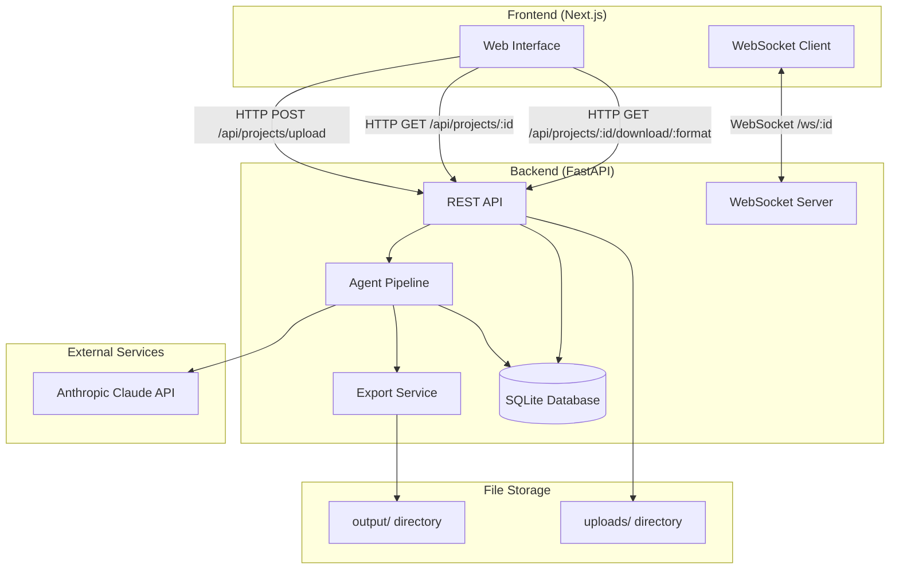
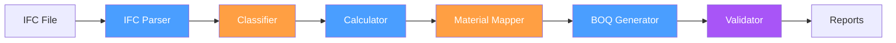
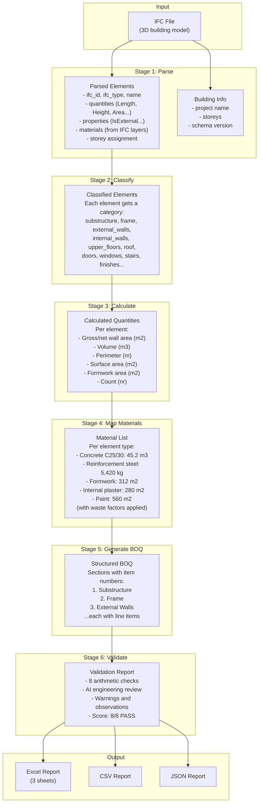

# System Architecture Overview

Metraj is a three-tier application: a Next.js frontend, a FastAPI backend, and a six-agent AI processing pipeline. This document describes the overall architecture, technology stack, and data flow.

---

## High-Level Architecture

---

## Technology Stack

| Layer | Technology | Purpose |
|---|---|---|
| **Frontend** | Next.js, Tailwind CSS, shadcn/ui | Web interface for file upload, progress tracking, report download |
| **API Server** | FastAPI, Uvicorn | REST endpoints, WebSocket for real-time progress, file handling |
| **AI Agents** | Custom Python agents | Six-stage processing pipeline |
| **AI Provider** | Anthropic Claude API | Element classification, material mapping, BOQ validation |
| **IFC Parsing** | IfcOpenShell | Reading BIM/IFC files (ISO 16739) |
| **Database** | SQLite (dev) / PostgreSQL (prod) | Project metadata and results persistence |
| **Reports** | openpyxl | Professional Excel spreadsheet generation |
| **Configuration** | Pydantic Settings, python-dotenv | Type-safe configuration from environment variables |
| **Logging** | Loguru | Structured logging across all components |

---

## Agent Pipeline

The core of Metraj is a six-agent pipeline that transforms an IFC file into a BOQ. Each agent reads from and writes to a shared state dictionary that flows through the pipeline.

**Legend:**
- Blue agents are **code-driven** (deterministic, no AI calls)
- Orange agents are **AI-powered** (use Claude API)
- Purple agents are **hybrid** (arithmetic checks + AI review)

| # | Agent | Type | Purpose |
|---|---|---|---|
| 1 | IFC Parser | Code | Extract building elements from IFC file |
| 2 | Classifier | AI | Categorize elements into BOQ sections |
| 3 | Calculator | Code | Compute construction quantities |
| 4 | Material Mapper | AI | Determine required materials per element |
| 5 | BOQ Generator | Code | Assemble structured BOQ from materials |
| 6 | Validator | Hybrid | Cross-check quantities and materials |

For detailed information about each agent, see [Agent Pipeline](agent-pipeline.md).

---

## Data Flow

The following diagram shows how data transforms as it passes through the pipeline:

---

## State Management

The pipeline uses a shared state dictionary (`dict[str, Any]`) that is passed from agent to agent. The state contains:

| Key | Set By | Description |
|---|---|---|
| `ifc_file_path` | Orchestrator | Path to the uploaded IFC file |
| `language` | Orchestrator | Output language: `en`, `tr`, or `ar` |
| `parsed_elements` | IFC Parser | List of element data dicts |
| `building_info` | IFC Parser | Project and building metadata |
| `classified_elements` | Classifier | Category to element ID mapping |
| `calculated_quantities` | Calculator | Per-element quantity breakdowns |
| `material_list` | Material Mapper | Aggregated material list with waste |
| `boq_data` | BOQ Generator | Structured BOQ sections and items |
| `validation_report` | Validator | Check results and AI assessment |
| `boq_file_paths` | Orchestrator (export) | Paths to generated report files |
| `status` | Each agent | Current processing status |
| `warnings` | Multiple agents | Non-fatal issues accumulated |
| `errors` | Multiple agents | Fatal issues that stop the pipeline |

---

## Inter-Stage Validation Gates

Between each pipeline stage, the Orchestrator runs validation gates -- fast, deterministic checks that catch catastrophic failures before downstream agents waste time on empty or corrupt data:

| After Stage | Gate Check |
|---|---|
| IFC Parsing | At least one element was parsed; building info is present (warning only if absent) |
| Classification | At least some elements were classified; fails if >50% unclassified, warns if >20% |
| Quantity Calculation | At least one quantity was computed; warns about all-zero quantities |
| Material Mapping | At least one material was produced |
| BOQ Generation | BOQ data structure is not empty; warns about empty sections |

If any gate fails, the pipeline stops immediately and reports the error. Warnings are accumulated but do not block processing.

---

## Request Lifecycle

When a user uploads an IFC file through the web interface:

1. The frontend sends the file via `POST /api/projects/upload`
2. The API validates the file (extension, size, IFC magic bytes), saves it, creates a database record
3. The pipeline runs asynchronously in the background via `asyncio.create_task`
4. Progress updates are pushed to the frontend via WebSocket (`/ws/{project_id}`)
5. On completion, results are persisted to the database and report files are generated
6. The frontend receives the `complete` WebSocket message and enables download buttons
7. The user downloads reports via `GET /api/projects/{project_id}/download/{format}`

---

## Geometry Fallback Engine

When an IFC file lacks Qto (Quantity Take-off) property sets, Metraj falls back to computing quantities directly from 3D geometry using `ifcopenshell.geom`. This is handled by `src/services/geometry_service.py`.

The geometry service tessellates element shapes and extracts:
- **Volumes** via `shape_util.get_volume`
- **Surface areas** via `shape_util.get_area`, `get_side_area`, `get_top_area`, `get_outer_surface_area`
- **Footprint areas** via `shape_util.get_footprint_area`
- **Bounding box dimensions** for deriving Length, Height, Width, and Depth

**Element-specific dimension mapping:** The bounding box dimensions are mapped to standard quantity names based on element type. For example, a wall's longest horizontal dimension becomes `Length` and the vertical becomes `Height`, while a slab's vertical dimension becomes `Depth`. This ensures geometry-derived quantities integrate seamlessly with the downstream calculator.

**Caching:** Computed geometry is cached per element ID (`self._cache`). If the same element is queried twice, the second call returns the cached result without recomputing. This is important because geometry tessellation is expensive.

**Failure tracking:** Elements that fail geometry computation (e.g., NULL representation, unsupported geometry types) are recorded in the `failures` list with the element ID, type, and error message, so they can be reported in the pipeline output.

---

## Confidence Scoring

Every BOQ line item receives a confidence score of HIGH, MEDIUM, or LOW, indicating how reliable the underlying data is. This is a fully deterministic system (no AI involved) implemented in `src/services/confidence_service.py` with data models in `src/models/confidence.py`.

**Penalty-based scoring:**
The system starts at a score of 1.0 (100%) and deducts penalties for each data quality concern:

| Concern | Penalty |
|---|---|
| Quantities from IFC Qto | 0% (best case) |
| Quantities from 3D geometry fallback | -10% |
| Quantities missing entirely | -40% |
| Storey-average opening deduction | -3% |
| Ratio-based rebar estimation | -2% |
| AI-guessed material mapping | -15% |
| Generic calculator (no dedicated rules) | -7% |

**Thresholds:**
- **HIGH** (score >= 85%): Data comes from reliable sources (Qto, exact openings, IFC rebar)
- **MEDIUM** (score >= 65%): Some approximations used (geometry fallback, storey-average openings, ratio-based rebar)
- **LOW** (score < 65%): Significant data gaps (no quantities, AI-guessed materials, generic rules)

**BOQ item scoring:** Individual element scores are combined using a weighted average (each contributing element weighted equally) to produce the final BOQ line item score. Items scored MEDIUM or LOW are flagged with `review_needed: true`.

---

## Learning Loop

Metraj includes a learning system that records user corrections to BOQ items and uses them to improve future pipeline runs. This is implemented in `src/services/learning_service.py`.

**How it works:**
1. When a user edits a BOQ line item (quantity, description, unit, or waste factor), the correction is recorded in the database with the original value, new value, element type, and category.
2. Each correction creates or updates a "learned override" -- a rule that maps an element type and category to a corrected value for a specific field.
3. The override tracks a `usage_count` (how many times users have made this same correction) and a `confidence` score computed from the count and consistency ratio.
4. **Activation threshold:** An override is only applied automatically when it has been recorded 3 or more times with a confidence score of at least 0.6. This prevents single corrections from changing future behavior.
5. When a user approves a project's BOQ (via the approve endpoint), all related override confidences are boosted by 0.1 (capped at 0.95).

**Confidence formula:** `min(0.5 + (usage_count * 0.1) * consistency_ratio, 0.95)`

This means a single correction starts at 0.6 confidence, and each additional consistent correction adds 0.1 up to the 0.95 cap.

---

## Per-Project Logging

Each project creates a detailed log file at `logs/projects/{project_id}/pipeline.log`. This log captures step-by-step processing details for the pipeline run, including:

- Element parsing counts and types
- Classification decisions and confidence
- Quantity calculation results per element
- Material mapping decisions
- Validation check results
- Timing information for each stage
- Warnings and errors encountered

These logs are invaluable for debugging issues with specific IFC files. They can be accessed via the API (`GET /api/projects/{project_id}/logs`) or directly on disk
